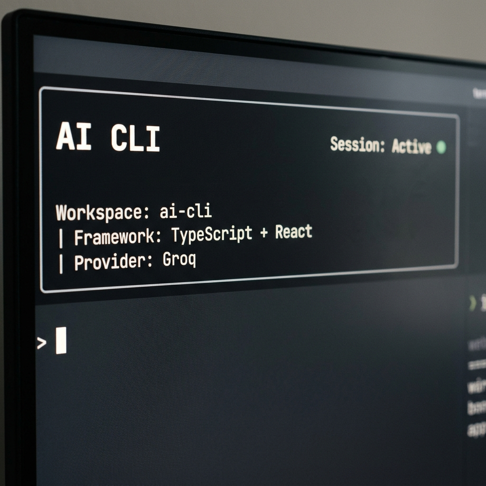
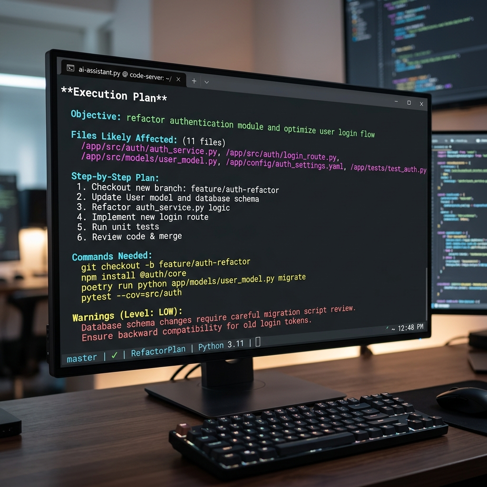
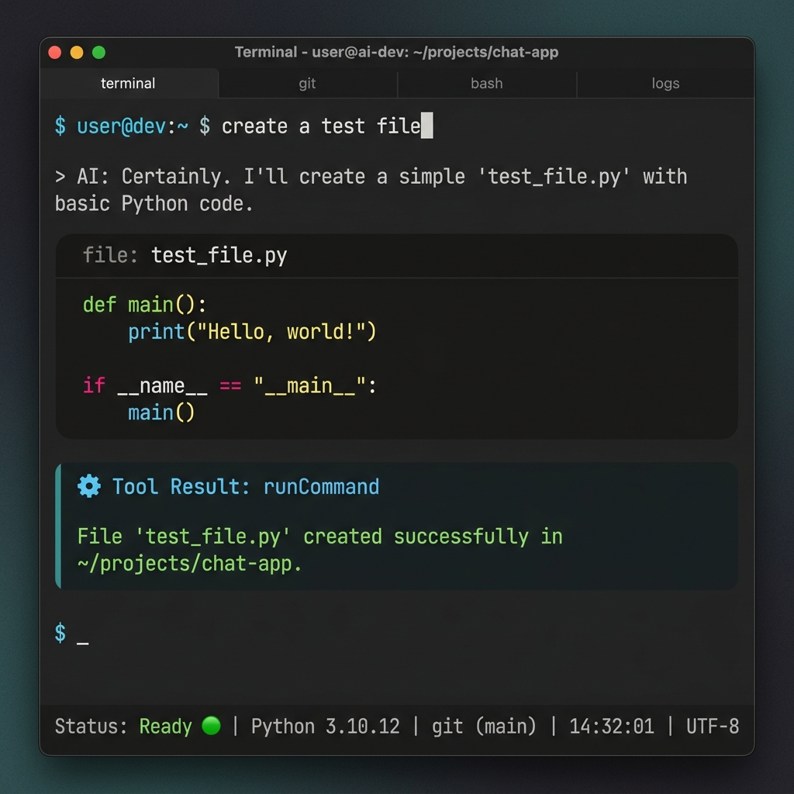

# AI CLI

An AI-native terminal-first developer runtime focused on orchestration, trustworthy planning, workspace awareness, and professional developer workflows.

---

## Screenshots


*TUI Startup & Workspace Initialization*


*Workspace-Aware Header displaying Frameworks and Active Provider*


*Structured JSON `/plan` Generation*


*Tool Execution & Orchestration Workflow*

---

## Core Features

- **Modern Ink TUI**: A responsive, lightweight, React-driven terminal interface.
- **Workspace-Aware Planning**: Dynamic ingestion of workspace structure to ground LLM context.
- **Framework Detection**: Automatic heuristic detection of project technology stacks.
- **Provider Abstraction**: Hot-swappable LLM engine support (e.g., Groq, Anthropic, Gemini).
- **RuntimeContext Architecture**: Centralized, decoupled state management for complete backend orchestration.
- **Async-Safe Orchestration**: Promises, timeout protections, and graceful fallbacks out of the box.
- **Structured Planning Output**: Strict JSON plan generation preventing AI hallucination.
- **Audit Logging**: Comprehensive, append-only logs for all permissions, tools, and scanning events.
- **MCP Support**: First-class Model Context Protocol integration.
- **Lightweight Runtime Design**: Low CPU footprint with optimized `<Static>` React rendering.
- **Regression-Tested Backend**: Hardened logic for providers, scanners, and tool executors.

---

## Architecture Overview

AI CLI is built upon a strict **orchestration-first architecture**. It completely decouples the terminal user interface from the backend runtime state, allowing headless testing, reliable tool execution, and deterministic planning.

- **RuntimeContext**: The central nervous system of the CLI. Holds the active history, active provider, workspace metadata, permissions, and tool executor state.
- **ToolExecutor**: Sandboxes tool execution and handles permission routing and audit logging.
- **Provider Abstraction**: A unified generic interface allowing zero-friction swapping between LLM providers.
- **UI Layer Separation**: The `AppLayout` solely consumes state from the `RuntimeContext` and renders reactively. It does not own orchestration logic.

```text
src/
├── commands/       # User command routing (e.g. /plan)
├── context/        # RuntimeContext (State Management)
├── logs/           # AuditLogger
├── mcp/            # Model Context Protocol integration
├── permissions/    # Security and prompt approvals
├── planning/       # Workspace-aware plan generation
├── providers/      # LLM API abstractions (Groq, Anthropic, Gemini)
├── tools/          # ToolExecutor and sandboxed operations
├── ui/             # React Ink Terminal Interface
├── utils/          # CLI parsers
└── workspace/      # Async scanners and framework detection
```

---

## TUI Features

The terminal interface uses [Ink](https://github.com/vadimdemedes/ink) to provide a premium, modern developer experience without dashboard clutter:

- **Ink-Based UI**: Responsive layout taking full advantage of terminal width.
- **Sticky Runtime Footer**: A consolidated, anchored input footer that remains perfectly stable during streaming or async rerenders.
- **Workspace Metadata**: Subtle display of active workspace name and detected frameworks.
- **Provider Visibility**: Clear indicator of the currently active LLM engine.
- **Structured Rendering**: Tool execution results and AI messages are visually distinct with clear hierarchy.
- **Markdown Rendering**: Full markdown support via `marked-terminal` for readable code blocks.
- **Loading States**: Smooth, async-bound Spinners.
- **Lightweight Strategy**: Optimized `<Static>` rendering ensures chat history does not flood memory or cause React rendering bottlenecks.

---

## Workspace Awareness

The CLI actively analyzes your repository during startup to provide the LLM with grounded, truthful context.

- **Async Scanning**: A non-blocking, recursive directory traversal runs dynamically during startup.
- **Framework Detection**: Heuristic analysis to detect technologies like:
  - TypeScript
  - React
  - Next.js
  - Express
  - Prisma
  - Vite
- **Intelligent Planning Context**: The active `ProjectRoot`, `Frameworks`, and `ImportantFolders` are directly injected into the planning system prompt.
- **Lightweight Caching**: Prevents redundant file I/O during heavy active sessions.
- **Timeout Protection**: The scanner strictly yields after 5000ms if the repository is excessively large.
- **Ignored Folders**: Safely ignores heavy cache and dependency trees (`node_modules`, `dist`, `.git`).

---

## Planning System

Trustworthy orchestration requires realistic, non-hallucinated plans. The CLI uses a dedicated `/plan` workflow to establish technical direction before executing modifications.

- **Workspace-Aware Orchestration**: Plans are generated using real workspace structure constraints.
- **Realistic File Suggestions**: The AI references precise, existing absolute or relative paths.
- **Structured Execution Plans**: The AI is forced to output strict JSON schemas containing steps, affected files, required commands, and complexity metrics.
- **Risk Visibility**: Clearly surfaces Low, Medium, and High-risk warnings for developers to review.

**Example Plan Output:**
```json
{
    "objective": "Integrate Prisma schema definitions",
    "filesAffected": ["D:/ai-cli/prisma/schema.prisma"],
    "steps": ["Initialize Prisma", "Define User model"],
    "commands": ["npx prisma init"],
    "warnings": ["May conflict with existing migrations"],
    "complexity": "Low",
    "nextAction": "Review plan and run /execute"
}
```

---

## Safety & Runtime Stability

The application is hardened to prevent standard CLI issues:

- **Non-Blocking Scanning**: Background scanning never freezes the UI.
- **Async-Safe Orchestration**: Complete Promise alignment prevents floating event loop leaks.
- **Low CPU Rendering**: Strict use of React lists prevents infinite rerender loops.
- **Timeout Protection**: Guardrails exist around all file system traversal APIs.
- **Regression-Tested**: Core systems pass programmatic headless assertions.
- **Provider Isolation**: Failed LLM responses are handled gracefully without crashing the UI.
- **Graceful Fallbacks**: Missing configurations or failed workspace scans yield silent, safe default fallbacks.

---

## Regression Testing

Core logic is fully verified through headless orchestration scripts to prevent regressions. Tested subsystems include:

- **Headless Orchestration**: Simulating workflows without firing up Ink `process.stdin`.
- **Provider Initialization**: Verifying `.env` loading and active engine selection.
- **RuntimeContext Validation**: Ensuring singleton state consistency.
- **Planning Validation**: Verifying that the `CommandParser` successfully triggers structured planning logic.
- **MCP Initialization**: Verifying valid server connections.
- **Workspace Scanner Testing**: Validating async yields and timeout clearances.

---

## Roadmap

Future direction focuses tightly on orchestrator reliability and terminal workflow speed:

- **Git-Aware Orchestration**: Injecting active diffs and git status into the context window.
- **Diff Previews**: Visually previewing AI code edits before applying to the filesystem.
- **Session Persistence**: Resuming previous terminal chats.
- **Smarter Workspace Context**: AST-level parsing for heavily requested languages.
- **Safer Execution Workflows**: Strict read/write permissions gating.
- **Improved Terminal UX**: Vim-style keybindings and scrollback buffers for large conversation histories.

---

## Philosophy / Vision

The AI CLI is built around the philosophy of **trustworthy orchestration**. 

We believe that developer productivity is best served by clean, fast, terminal-first workflows. We prioritize workflow clarity and robust architecture over flashy marketing and hype. The AI CLI is designed as a lightweight runtime system for developers who want a powerful assistant without sacrificing terminal speed or architectural control.

---

## Current Status

This is an actively developed research tool. It provides a robust, testable orchestration foundation but is not yet a production-ready enterprise scalability platform or a fully autonomous "super-agent."

---

## License

ISC
