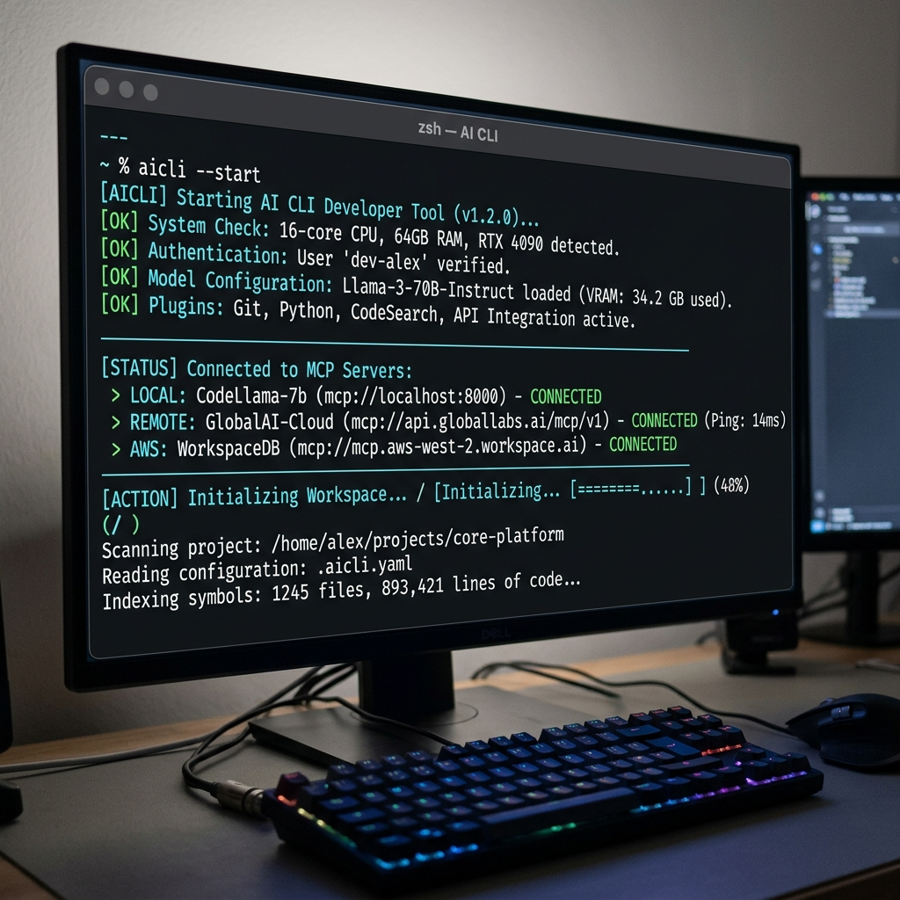

# ORK: Trust-Oriented Orchestration Runtime

A terminal-native AI developer runtime built for professional engineers who demand explicit control, absolute determinism, and approval-first execution.

---

## 🛑 The Core Philosophy: "AI Proposes. Human Approves."

We fundamentally reject the concept of a "fully autonomous coding agent" operating blindly in the background. Real-world engineering requires predictability and control. ORK intentionally prioritizes trust, predictability, and orchestration clarity over blind autonomy. 

- **Visibility Before Execution:** You see exactly what the AI intends to do—whether it's a file edit, a shell command, or an MCP tool call—*before* anything mutates on disk.
- **Deterministic Orchestration:** Complex, multi-step LLM generations are strictly serialized into a predictable execution pipeline.
- **Developer-Controlled Workflows:** The developer remains firmly in the loop as the final arbitrator of system state.

---

## Security & Trust Architecture

To ensure operational reliability and developer trust, the runtime enforces a hardened security layer around all execution boundaries:

- **ApprovalQueue Serialization:** Concurrent tool calls from the AI are queued and serialized, preventing race conditions and ensuring deterministic execution ordering.
- **ExecutionPipeline:** A centralized execution boundary that wraps every file mutation and shell command, enforcing timeouts, safety checks, and audit logging.
- **Safe Mode Enforcement:** Blocks destructive commands entirely when enabled.
- **TOCTOU Protection:** Time-Of-Check to Time-Of-Use hashing guarantees that if a file is modified externally while sitting in the approval queue, the execution is safely aborted.
- **Workspace Boundary Enforcement:** Real-path resolution strictly prevents the AI from escaping the current repository via symlinks or nested execution paths.
- **Interpreter Execution Blocking:** Proactively intercepts attempts to run raw scripts directly via `bash`, `python`, or `node`, forcing transparent command execution.
- **Diff Truncation Protection:** Ensures large file diffs cannot hide malicious payloads in un-rendered chunks by explicitly warning on truncation.
- **Large-File Safeguards:** Gracefully aborts diff generation on massive files to prevent Event Loop blocking and UI freezing.
- **MCP Capability Risk Escalation:** Flags potentially dangerous third-party tools connected via the Model Context Protocol.
- **Queue Crash Recovery & ErrorBoundary:** TUI rendering crashes instantly trigger an `abortAll()` on the orchestration queue, unfreezing the REPL and preventing hidden dangling executions.
- **Append-Only Audit Logging:** Immutable tracking of all execution requests, providing full post-mortem visibility.

These systems exist for one reason: to guarantee that the runtime behaves exactly as expected, even when the AI generates highly complex or unpredictable orchestration outputs.

---

## Stabilization & Stress Testing

To achieve production-grade stability, the runtime recently underwent an intense, automated stabilization phase featuring:

- **500-Iteration Stress Testing:** Hammering the orchestration pipeline with rapid, concurrent file writes, synthetic TUI crashes, and cancellation bursts.
- **Queue Determinism Validation:** Ensuring zero race conditions between active tool executions.
- **Event-Loop Lag Monitoring:** Measuring timer drift to detect and resolve synchronous bottlenecks (e.g., diff generation blocking).
- **Listener Leak Detection:** Monitoring global listeners across repeated approval cycles.
- **REPL Recovery Testing:** Guaranteeing that after simulated crash flushes and `abortAll()` calls, the terminal unfreezes and accepts user input instantly.
- **Async Cleanup Verification:** Tracking pending promises to guarantee zero async memory leaks.

During this stabilization loop, real operational bugs—such as a catastrophic queue deadlock during UI crashes—were discovered and surgically fixed using `Promise.race()` handlers, cementing the runtime's reliability.

---

## Current Status

- **Production-Ready Orchestration Foundation:** The core pipeline, queue, and security boundary are locked in and hardened.
- **Stable for Real-World Workflows:** Memory, event-loop, and orchestration state are proven stable over extended developer sessions.
- **Under Active Workflow Refinement:** Focusing on ergonomics, speed, and real-world utility.

---

## Terminal UX 

*Visualizing trust-oriented orchestration.*


*Workspace initialization and Git context detection.*

<!-- TODO: Insert ApprovalPanel Screenshot here -->
*Approval Panel: Clear visualization of proposed actions.*

<!-- TODO: Insert DiffViewer Screenshot here -->
*Diff Viewer: Strict, bounded preview of filesystem mutations.*

<!-- TODO: Insert ExecutionTimeline Screenshot here -->
*Execution Timeline: Real-time visibility into the orchestration state.*

---

## Universal BYOK Multi-Provider Architecture

The runtime features a fully realized **Bring Your Own Key (BYOK)** ecosystem, seamlessly integrating commercial models, open networks, and local inference without sacrificing trust or predictability.

- **Master Key Security**: All provider credentials are encrypted locally using AES-256-GCM via a machine-independent `master.key`. We never store API keys in plaintext and never exfiltrate credentials to the cloud.
- **Universal Abstraction**: Deep native support for Anthropic, Gemini, OpenAI-compatible APIs (OpenRouter, Groq, DeepSeek, xAI, Together, Mistral), and local endpoints (Ollama, LM Studio).
- **Session Isolation**: Switching providers instantly wipes temporary model context, tool mappings, and streaming state to guarantee deterministic behavior and prevent cross-provider contamination.
- **Streaming Normalization**: Disparate provider behaviors—from raw SSE chunks to reasoning blocks and fragmented tool-calls—are unified into a single, predictable terminal rendering stream.
- **Local-First Safety**: Hardened endpoint validation specifically prevents remote URL injection attacks on localhost inference servers.

```bash
# Terminal Native Provider Management
/provider add openrouter     # Securely encrypts and stores key
/provider switch deepseek    # Dynamically hot-swaps active engine
/provider health             # Queries provider status (cached for 30s)
/model switch claude-3-7     # Switches active model seamlessly
```

---

## Upcoming Roadmap

With the orchestration architecture and multi-provider foundation fully stabilized, the upcoming focus shifts toward workflow ergonomics:

- **Workflow Refinement**: Streamlining the terminal UI for faster approval cycles (e.g., batching trusted operations).
- **Performance Optimization**: Reducing TUI render overhead and improving diff parsing speeds.
- **Developer Ergonomics**: Polishing the REPL for standard coding workflows.

---

## License

ISC
